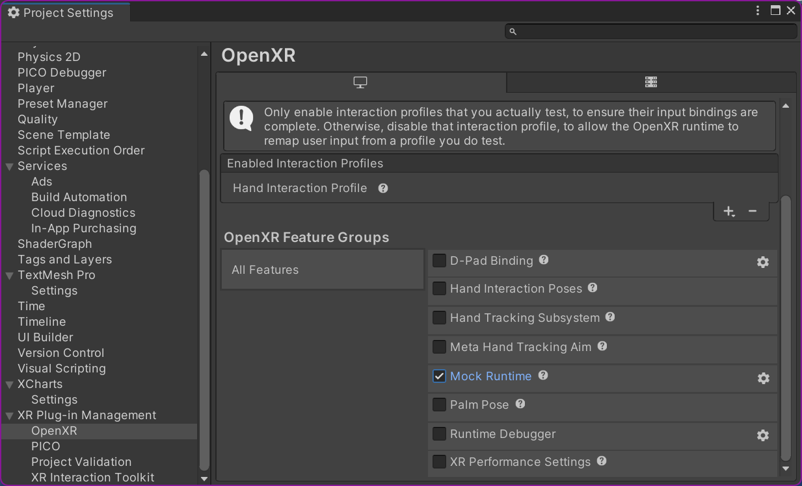

# PICO 4を使ったVRについて

## 必要なソフトウェア
### SteamVR
https://store.steampowered.com/app/250820/SteamVR/
Steamが必要 -> https://store.steampowered.com/about/
インストーラーの指示に従ってインストールするだけ．  
Steamのアカウントが必要．誰のものでも可．  
### Streaming Assistant
https://www.picoxr.com/jp/software/pico-link
「ストリーミングアシスタント」を選択してインストーラーをダウンロード．
インストーラーの指示に従ってインストールするだけ．
PICO Accountが必要．電装班のものがある．

## Unityで必要な設定
### OpenVR Plagin
### (任意)XR Interaction Toolkit

## PICO Unity OpenXR SDK
https://developer.picoxr.com/document/unity-openxr/import-the-pico-unity-openxr-sdk/

## Project Settings
- `XR Plug-in Managemant` > `OpenXR` > `OpenXR Feature Groups`で，
`Mock Runtime`にチェックが入っているとVRは起動しない．
  
